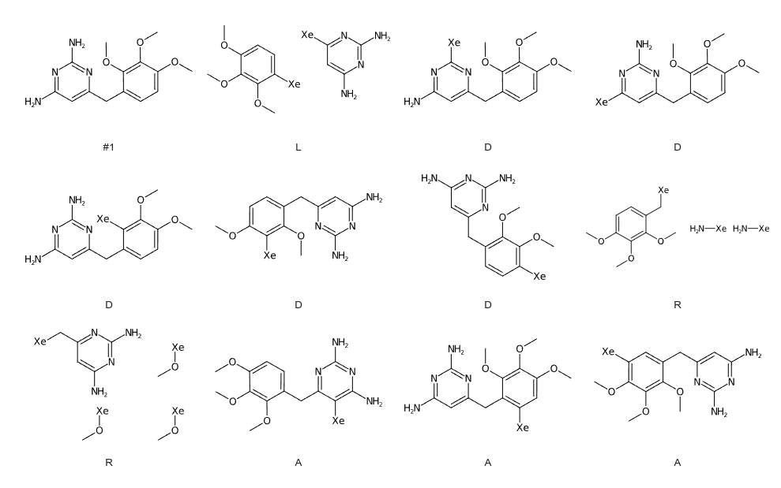

Fragment Network Vectors
========================

This document tries to describe how the fragment network vectors are handled.

Vector Generation
-----------------

Vector data is generated when a target is uploaded.
The entrypoint is the ``analyse_target()`` function in ``viewer/target_set_upload.py``.
Ultimately it’s a call to ``get_vectors()`` that actually creates the vectors and 3d records.

There are two relevant database tables, ``hypothesis_vector`` and ``hypothesis_vector3d``.
The first contains the definition of the vectors (e.g. the location of the vector) with respect to the ``viewer_compound`` table.
The second contains the 3D coordinates (start an end point) of the actual 3D vector related to the ``viewer_molecule`` table.

The ``get_vectors()`` function uses the ``frag.network.decorate.get_3d_vects_for_mol()`` from the
fragalysis repo (https://github.com/xchem/fragalysis) repo to analyse the molecule and create the vector data.
The data is returned as a Python dictionary. For example, for this SMILES ``COc1ccc(Cc2cc(N)nc(N)n2)c(OC)c1OC``
the following data is generated::

    {
      'linkers': {
        'COc1ccc([Xe])c(OC)c1OC.Nc1cc([Xe])nc(N)n1': [(-1.3931, -0.3178, 1.6803), (-2.8284, 1.2604, 3.3541), (-3.3955, 0.5713, 2.3605), (-2.8284, 1.2604, 3.3541)]
      },
      'deletions': {
        'COc1ccc(Cc2cc(N)nc([Xe])n2)c(OC)c1OC': [(-2.8284, 1.2604, 3.3541), (-2.8284, 1.2604, 3.3541)],
        'COc1ccc(Cc2cc([Xe])nc(N)n2)c(OC)c1OC': [(-2.7309, -0.2154, 1.5116), (-2.8284, 1.2604, 3.3541)],
        'COc1ccc(Cc2cc(N)nc(N)n2)c([Xe])c1OC': [(-0.7313, 0.3607, 2.6834), (-2.8284, 1.2604, 3.3541)],
        'COc1ccc(Cc2cc(N)nc(N)n2)c(OC)c1[Xe]': [(-1.4984, 1.1631, 3.4943), (-2.8284, 1.2604, 3.3541)],
        'COc1c([Xe])ccc(Cc2cc(N)nc(N)n2)c1OC': [(-0.2665, 0.2739, -1.2642), (-2.8284, 1.2604, 3.3541)]
      },
      'ring': {
        'COc1ccc(C[Xe])c(OC)c1OC.N[Xe].N[Xe]': [(-3.3955, 0.5713, 2.3605), (-2.8284, 1.2604, 3.3541), (-2.8284, 1.2604, 3.3541), (-2.8284, 1.2604, 3.3541), (-2.7309, -0.2154, 1.5116), (-2.8284, 1.2604, 3.3541)],
        'CO[Xe].CO[Xe].CO[Xe].Nc1cc(C[Xe])nc(N)n1': [(-0.7313, 0.3607, 2.6834), (-2.8284, 1.2604, 3.3541), (-1.4984, 1.1631, 3.4943), (-2.8284, 1.2604, 3.3541), (-0.2665, 0.2739, -1.2642), (-2.8284, 1.2604, 3.3541), (-1.3931, -0.3178, 1.6803), (-2.8284, 1.2604, 3.3541)]
      },
      'additions': {
        'COc1ccc(Cc2nc(N)nc(N)c2[Xe])c(OC)c1OC__0': [(-0.7313, 0.3607, 2.6834), (0.3550432234908941, 0.2643353596228167, 2.826830320575495)],
        'COc1cc([Xe])c(Cc2cc(N)nc(N)n2)c(OC)c1OC__0': [(-0.2665, 0.2739, -1.2642), (-1.3590949762544902, 0.3155256056977563, -1.3846305891945447)],
        'COc1c([Xe])cc(Cc2cc(N)nc(N)n2)c(OC)c1OC__0': [(0.5504, 0.9772, -2.1574), (0.09491642463792072, 1.5537821952831012, -2.9759888373645813)]
      }
    }

Those molecules are as follows:

Vector Display
--------------

In the Fragalysis front end these vectors are displayed as arrows/cylinders emanating from the appropriate point
in the molecules. These imply a point of change in the molecule e.g. a potential substitution point.

They are colour coded based on the occurrence of such changes in the fragment network database:
- Red means no examples found
- Yellow means 5 or fewer examples found
- Green means more than 5 examples found
TODO - confirm these numbers.

TODO - describe how and when that data is generated
